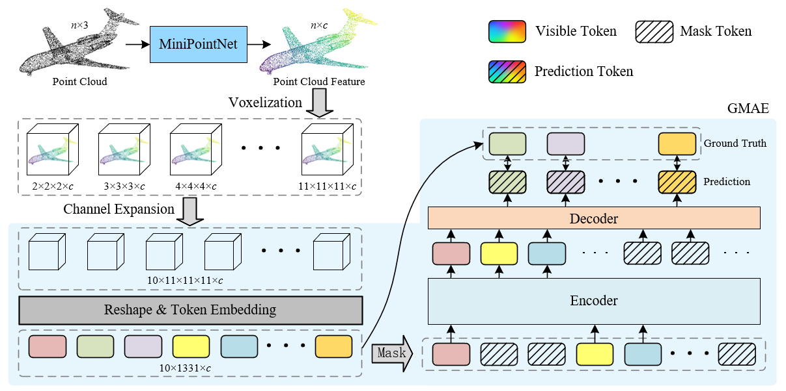

# VP-GMAE

## Global Mask Autoencoder for Streamlined Point Cloud Learning and Voxel Token Integration

The Masked Autoencoder (MAE)-based approach for self-supervised point cloud learning has demonstrated strong feature extraction capabilities but encounters several challenges. Most MAE methods rely on Farthest Point Sampling (FPS) and K-Nearest Neighbors (KNN) for partitioning point clouds, which is time-consuming and can result in redundant information due to overlapping patches. To address these issues, we introduce the Global Masked Autoencoder (GMAE), which leverages voxel-based global shapes at various resolutions as tokens instead of local patches. This approach mitigates redundancy and reduces computational time associated with local patch partitioning in MAE.
Further building on this, we propose VP-GMAE, a self-supervised point cloud model that reconstructs masked voxel features at multiple scales as a pretext task. VP-GMAE incorporates a channel expansion module to standardize the number of channels across different voxel scales, facilitating their simultaneous input into the encoder. We pre-train VP-GMAE on the ShapeNet dataset and fine-tune it on ModelNet40 and ScanObjectNN, evaluating its performance across object classification, few-shot classification, and part segmentation tasks. 

<div  align="center">    
 
</div>

## 1. Requirements

- PyTorch >=1.7.0
- python >= 3.7
- CUDA >= 9.0
- GCC >= 4.9
- torchvision

```
pip install -r requirements.txt
```

```
# Chamfer Distance & emd
cd ./extensions/chamfer_dist
python setup.py install --user
cd ./extensions/emd
python setup.py install --user
# PointNet++
pip install "git+https://github.com/erikwijmans/Pointnet2_PyTorch.git#egg=pointnet2_ops&subdirectory=pointnet2_ops_lib"
```

## 2. Datasets

We use ShapeNet, ScanObjectNN, ModelNet40 and ShapeNetPart for pre-training the VP-GMAE model. See [DATASET.md](./DATASET.md) for details.

## 3. VP-GMAE Pre-training

To pretrain VP-GMAE on ShapeNet training set, run the following command. 

```
python main.py --config cfgs\pretrain-VSSL.yaml --exp_name [exp name]
```
## 4. VP-GMAE Fine-tuning

Fine-tuning on ScanObjectNN(hardest), run the following command:
```
python main.py --config cfgs\finetune_scan_hardest.yaml --finetune_model --exp_name modelnet1_12 --ckpts [pretrain model path]
```
Fine-tuning on ModelNet40, run the following command:
```
python main.py --config cfgs\finetune_modelnet.yaml --finetune_model --exp_name modelnet1_12 --ckpts [pretrain model path]
```

Few-shot learning, run the following command:
```
python main.py --config cfgs/fewshot.yaml --finetune_model
--ckpts [pretrain model path] --exp_name [exp name] --way [5 or 10] --shot [10 or 20] --fold [0-9]
```
Part segmentation on ShapeNetPart, run the following command:
```
python segmentation\main.py --normal --ckpts [pretrain model path] --root [dataset path]
```

## Acknowledgements

Our codes are built upon [Point-MAE](https://github.com/Pang-Yatian/Point-MAE), [Point-BERT](https://github.com/lulutang0608/Point-BERT), [Pointnet2_PyTorch](https://github.com/erikwijmans/Pointnet2_PyTorch) and [Pointnet_Pointnet2_pytorch](https://github.com/yanx27/Pointnet_Pointnet2_pytorch)
